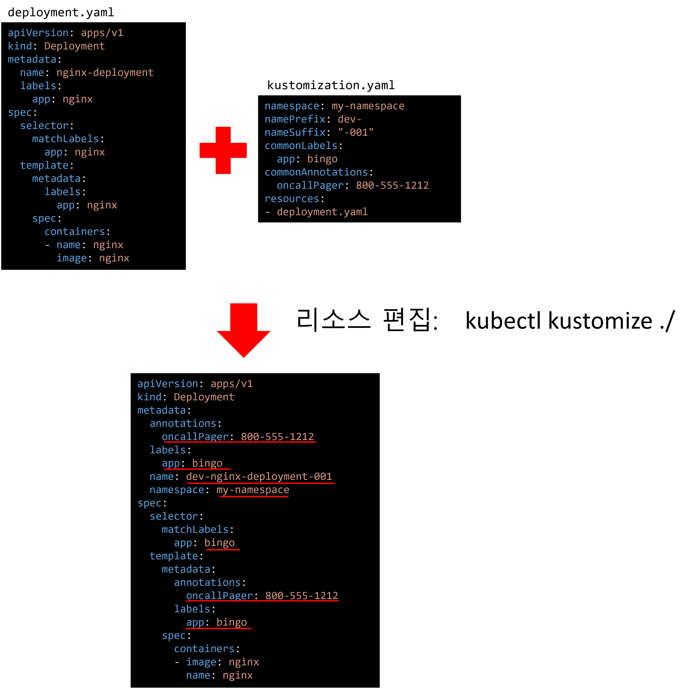

# 개요
* kustomize 연습

# 들어가며
* kustomize는 [쿠버네티스 공식문서](https://kubernetes.io/ko/docs/tasks/manage-kubernetes-objects/kustomization)를 참고하여 공부하시면 좋습니다.

# Kustomize란?
* 쿠버네티스 리소스를 쿠버네티스 문법에 구애받지 않고 변경(생성, 수정 등)합니다.
* kubectl v1.4?버전부터 내장되어 kustomize 명령어가 내장되어 있습니다.

# 기본 설정
* kustomization.yaml파일을 생성하면 모든 준비가 끝입니다.

# 첫 번째 예제: cross-cutting fields
* 기존 리소스를 잘라서 수정, 즉 값을 변경합니다.
* 아래 그림을 보시면 kustomization.yaml에 설정된 값으로 기존 deployment.yaml 필드가 변경됩니다.

